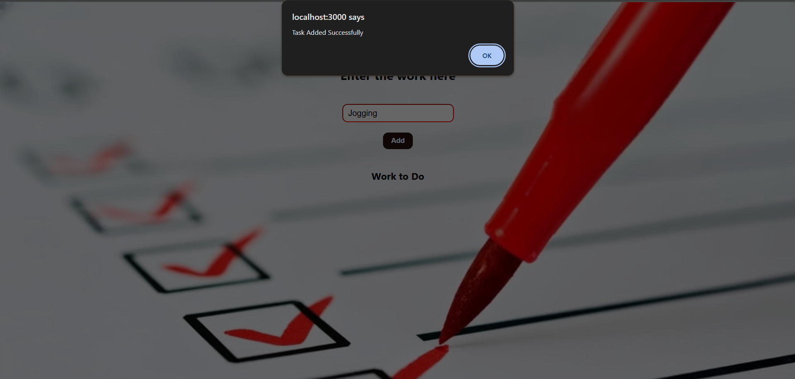
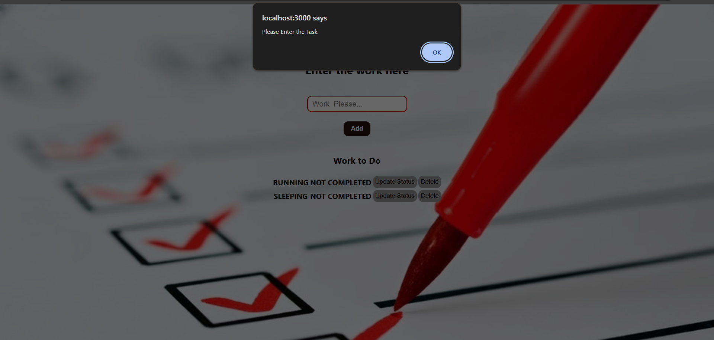

# 📝 To-Do App

A simple and efficient **To-Do List App** built using **React**. This app helps users organize their daily tasks by allowing them to add, mark as complete, and delete items.

---

## 🚀 Features

- ✅ Add new tasks  
- ⏳ Mark tasks as completed or pending  
- 🗑️ Delete individual tasks  

---

## 📸 Screenshots

> *Below are screenshots demonstrating the functionality of the app:*







---

## ⚙️ Tech Stack

- React (Functional Components + Hooks)  
- HTML5 & CSS3  
- JavaScript (ES6+)  

---

## 🛠️ Getting Started

### Prerequisites

- Node.js and npm must be installed

### Installation

```bash
git clone https://github.com/MSAdithya45/To-Do-App.git
cd To-Do-App
npm install
npm start
